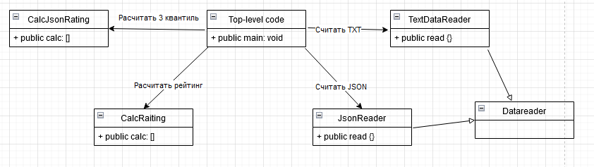

# Лабораторная работа 1 по дисциплине "Технологии программирования"
## Знакомство с системой контроля версий Git и инструментом CI/CD GitHub Actions
## Цели 
1. Познакомиться c распределенной системой контроля версий кода Git и ее функциями;
2. Познакомиться с понятиями «непрерывная интеграция» (CI) и «непрерывное развертывание»
(CD), определить их место в современной разработке программного обеспечения;
3. Получить навыки разработки ООП-программ и написания модульных тестов к ним на
современных языках программирования;
4. Получить навыки работы с системой Git для хранения и управления версиями ПО;
5. Получить навыки управления автоматизированным тестированием программного обеспечения,
расположенного в системе Git, с помощью инструмента GitHub Actions.

## Постановка задачи
1. Выбрать лицензию для проекта
2. Добавьте в проект файл .gitignore и сформируйте его содержимое
3. Добавить в проект класс наследник DataReader
4. Добавить в проект класс реализующий расчёт определенных характеристик студентов
5. Составление UML иаграммы
6. Проанализировать полученные результаты и сденлать выводы

## Описание индивидуальной задачи
Определить и вывести на экран всех студентов, чей
рейтинг попадает в третью квартиль распределения по
рейтингам.

## Этапы работы
1. Клонирование репозитория 
2. Добавление лицензии
3. Добавление gitignore
4. Добавление класса для считывания JSON
5. Добавление класса для расчёта третьей квартили распределения студентов по рейтингу
6. Составление UML диаграммы
7. Написание вывода

## UML диаграмма классов

## Выводы
По итогу проделанной работы, была создана программа позволяющая получить данные из JSON
файла и расчитать третью квартиль распределения по рейтингам, так же были освоены навыки
работы с git.